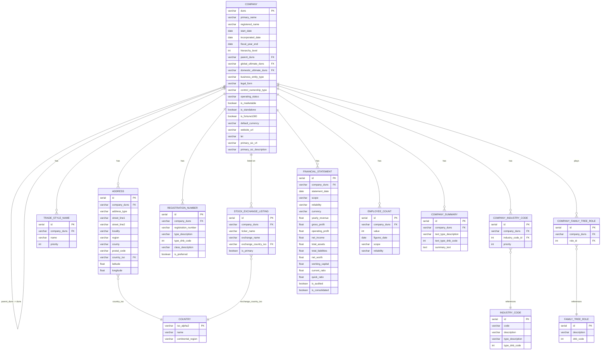

# JSON Files Analysis

The raw JSON files (`data_blocks.json` and `family_tree.json`) were delivered as single-line, minified blobs. Without formatting, some proprties were hard to determine.

- **Nesting depth** — Without formatting and indentation, tracing the path of a field required counting brackets manually.
- **Array vs object distinction** — `industryCodes`, `tradeStyleNames`, `stockExchanges`, and `registrationNumbers` are all arrays at the top level; in minified form they appear identical to scalar objects until parsed. Beautifying made it immediately clear that these fields are **one-to-many** relationships.
- **Null vs absent fields** — many fields such as `isAgent`, `isImporter`, `streetNumber`, and `minorTownName` are explicitly `null` rather than omitted. This distinction is important for schema design: it tells us these columns exist and must be nullable, not simply excluded.
- **Repeated substructures** — the `financials` block appears in three different locations: at root level, under `globalUltimate`, and under `domesticUltimate`. Without indentation this redundancy is invisible and could lead to double-counting during ingestion.
- **Hierarchy shape in the family tree** — the `family_tree` file is a flat array of 500 member objects (out of the total 1,299 in the full corporate tree; the API caps the returned set and excludes 500 branches). Each member carries a `parent.duns` and optionally a `children[].duns` list. Beautified, it became clear that the children array stores **only the DUNS pointer**, not embedded subtrees, confirming a flat structure with self-referential FKs rather than a recursive JSON tree.

In short, beautification transformed the files into something more readable. However, the scale of information contained in the files was hard to difficult to relate.

Thus copilot was used to provide more clarity on the information presentd

> **Note:** the following analysis of the json files was made using copilot assistance

---

## Data Structure Overview

### `data_blocks_beautified.json`

Rich profile of the **root company only** (Microsoft Corporation). Key fields:

- **Identity** — `duns`, `primaryName`, `tradeStyleNames[]`, `startDate`, `registeredName`
- **Classification** — `industryCodes[]` (NAICS 2022, SIC, D&B, NACE, ISIC), `primaryIndustryCode`, `unspscCodes[]`
- **Address** — `primaryAddress` (country ISO, region, county, street, lat/long, postal code)
- **Legal** — `businessEntityType`, `legalForm`, `incorporatedDate`, `charterType`, `registrationNumbers[]`
- **Operating status** — `dunsControlStatus` (active/inactive, marketable, first report date)
- **Financials** — `financials[].yearlyRevenue`, `latestFiscalFinancials.overview` (full balance sheet + ratios)
- **Workforce** — `numberOfEmployees[]` (consolidated & individual scope, with historical trend)
- **Market** — `stockExchanges[]`, `controlOwnershipType`, `isFortune1000Listed`
- **Linkage** — `corporateLinkage` (roles, hierarchy level, globalUltimate ref, domesticUltimate ref)
- **Narrative** — `summary[]` (company profile, operations, M&A, financial performance, history)

### `family_tree_beautified.json`

The full Microsoft corporate tree has **1,299 entities** (`globalUltimateFamilyTreeMembersCount`), but the API response returns **500 member records** in the `familyTreeMembers` array (500 branch offices were excluded by the `exclusionCriteria: "Branches"` query parameter). Each `familyTreeMember` object contains:

- `duns` — Unique D&B identifier, primary key equivalent
- `primaryName` — Legal name of the entity
- `startDate` — Founding / registration date
- `primaryAddress` — Country, locality, region, postal code, street
- `primaryIndustryCode.usSicV4` — Primary SIC code and description
- `tradeStyleNames[]` — Trading names / DBAs
- `corporateLinkage.hierarchyLevel` — Depth in the ownership tree (1 = Global Ultimate)
- `corporateLinkage.parent.duns` — FK pointer to the immediate parent entity
- `corporateLinkage.children[].duns` — FK pointers to direct subsidiaries
- `corporateLinkage.familytreeRolesPlayed[]` — Roles: Global Ultimate, Domestic Ultimate, Parent/HQ, Subsidiary
- `numberOfEmployees[].value` — Headcount for that entity
- `financials[].yearlyRevenues[].value` — Annual revenue reported for that entity

---

## Key Insights

1. **Microsoft is its own Global Ultimate and Domestic Ultimate** (`hierarchyLevel: 1`), confirming it is the apex of a purely US-headquartered tree. All other members ultimately roll up to DUNS `081466849`.

2. **The hierarchy is multi-level, not flat — reaching 8 levels deep.** The 500 returned members are distributed across hierarchy levels: 1 (×1), 2 (×193), 3 (×142), 4 (×43), 5 (×12), 6 (×67), 7 (×38), 8 (×4). Direct subsidiaries sit at `hierarchyLevel: 2` (e.g., Microsoft Japan, Activision Blizzard), and 78 entities in the tree have their own `children[]` array, creating a deep ownership chain that a relational model must handle via a self-referential foreign key.

3. **A single entity can hold multiple roles simultaneously.** For example, Microsoft Japan is tagged as both `Subsidiary` and `Domestic Ultimate` and `Parent/Headquarters` — it is a leaf relative to Microsoft Corporation but a root within Japan's domestic subtree. This many-to-many role relationship requires a bridge table.

4. **Children arrays contain DUNS pointers only** — full details live in the flat `familyTreeMembers` array. This confirms that adjacency-list modelling (each row stores its parent DUNS) is the right approach rather than a nested-set or closure-table, unless advanced tree traversal queries require it.

5. **Multiple industry classification systems coexist per company.** Microsoft alone carries **22 industry codes** across 7 classification systems (NAICS 2022, US SIC 1987, D&B Standard, NACE Rev 2, ISIC Rev 4, D&B Hoovers, D&B Standard Major), plus **6 UNSPSC codes** in a separate array. Each code carries a `priority`, `typeDescription`, and `typeDnBCode`, requiring a normalised `IndustryCode` table linked via a junction table.

6. **Financial data has scope and reliability qualifiers.** Revenue and employee counts are tagged with `informationScopeDescription` (Consolidated vs Individual) and `reliabilityDescription` (Actual vs Modelled). These qualifiers are semantically significant and must be preserved as columns, not discarded.

7. **The data_blocks file is significantly richer than family tree member records.** It carries the full balance sheet, 10 financial ratios, historical employee growth trends, stock exchange listings across **30 markets**, business summaries, registration numbers, and trust index data — none of which appear in the family tree members. Designing the schema must accommodate both levels of richness.

8. **Address geolocation is present** for the root company (`latitude: 47.63921`, `longitude: -122.12971`), but absent from most family tree members. The schema should make these columns optional (nullable).

9. **The family tree snapshot is time-stamped.** The `transactionTimestamp` field records when the tree was pulled. If trees are refreshed periodically, a `snapshot_date` column will be needed to version the hierarchy.

10. **1,299 entities (full tree) across up to 8 hierarchy levels makes recursive traversal non-trivial.** A closure table or materialised path column should be evaluated for queries that need to aggregate all descendants of a given node (e.g., total group revenue, total group headcount).

---

## Actionable Steps — Task 1: Relational Database Schema Design

### Step 1 — Identify core entities

- `company` — Both files, one row per DUNS
- `address` — `primaryAddress` block within both files
- `country` — ISO alpha-2 codes across all address fields
- `industry_code` — `industryCodes[]` and `primaryIndustryCode`
- `company_industry_code` — Junction table, company ↔ industry code (many-to-many)
- `trade_style_name` — `tradeStyleNames[]` (one-to-many per company)
- `family_tree_role` — Lookup for `familytreeRolesPlayed` descriptions
- `company_family_tree_role` — Junction, company ↔ role (many-to-many)
- `registration_number` — `registrationNumbers[]` (one-to-many per company)
- `stock_exchange_listing` — `stockExchanges[]` (one-to-many per company)
- `financial_statement` — `latestFiscalFinancials` / `financials[]` (one-to-many per company)
- `employee_count` — `numberOfEmployees[]` (one-to-many per company, multiple scopes)
- `company_summary` — `summary[]` text blocks (one-to-many per company, by type)

### Step 2 — Model the hierarchy

- Add `parent_duns` (nullable FK → `company.duns`) to the `company` table — **adjacency list** pattern.
- Add `hierarchy_level` integer column.
- Add `global_ultimate_duns` and `domestic_ultimate_duns` as denormalised FK columns for fast roll-up queries without recursive CTEs.
- Optionally materialise a **closure table** (`company_ancestor`) with `(ancestor_duns, descendant_duns, depth)` for efficient traversal across all hierarchy depths.

### Step 3 — Normalise multi-value and repeated fields

- `industryCodes` → `industry_code` + `company_industry_code` junction (preserving `priority` and `type`).
- `stockExchanges` → `stock_exchange_listing` with `ticker_name`, `exchange_name`, `exchange_country_iso`, `is_primary`.
- `registrationNumbers` → `registration_number` with `type_description`, `type_dnb_code`, `is_preferred`.
- `numberOfEmployees` → `employee_count` with `scope`, `reliability`, `figures_date`.
- `financials[].yearlyRevenue` → rows in `financial_statement` with `statement_date`, `scope`, `reliability`, `currency`, `revenue`.
- `summary[]` → `company_summary` with `text_type_description` and `text` (HTML).

### Step 4 — Define primary and foreign keys

- `company.duns` → **primary key** (D&B DUNS is a stable, globally unique 9-digit identifier).
- `company.parent_duns` → FK → `company.duns` (self-referential, nullable for root nodes).
- All `_duns` foreign keys reference `company.duns`.
- Surrogate integer PKs on all child tables (`id SERIAL PRIMARY KEY`) with a unique index on the natural key where applicable.

### Step 5 — Handle nullable and optional fields

- Fields absent from family tree members but present in data_blocks (e.g., `latitude`, `longitude`, `legalForm`, `incorporatedDate`, full financials) → `NULL`-able columns.
- `isAgent`, `isImporter`, `isExporter`, `isSmallBusiness` → nullable booleans, not omitted columns.

### Step 6 — Validate with sample queries

Before finalising the schema, verify it supports:
- "List all direct subsidiaries of Microsoft" → single-hop parent FK join.
- "List all companies in the Microsoft group" → recursive CTE or closure table scan.
- "What is the total consolidated revenue of the group?" → aggregate on `financial_statement` filtered by `global_ultimate_duns`.
- "Which companies are listed on NASDAQ?" → join `company` ↔ `stock_exchange_listing`.
- "Which companies operate in Software Publishing (NAICS 513210)?" → join through `company_industry_code`.

---

## Proposed ERD

