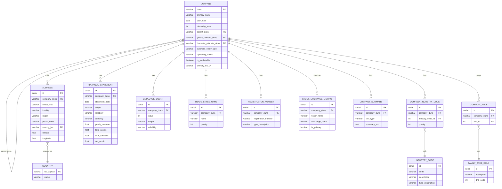

# Company A — Microsoft Corporation

DUNS: `081466849` | Source: D&B API | Snapshot: Jan 2025

## Why beautify the JSON?

The raw files were minified single-line blobs — basically unreadable. Formatting them was necessary to actually understand what we're working with:

- The nesting goes 4-5 levels deep (e.g. `corporateLinkage.familytreeRolesPlayed[].description`), impossible to trace without indentation
- Hard to tell which fields are arrays vs objects — turns out `industryCodes`, `stockExchanges`, `registrationNumbers` etc. are all arrays, meaning they need their own tables
- Some fields are explicitly `null` (like `isAgent`, `isImporter`) rather than missing — important distinction for the schema
- The `financials` block is duplicated in 3 places (root, `globalUltimate`, `domesticUltimate`) which could easily cause double-counting if you don't notice it
- The family tree is a flat array of 500 members with `parent.duns` pointers, not a nested tree — this tells us an adjacency list model is the way to go

## What's in the data

### `data_blocks_beautified.json`

Detailed profile of just the root company (Microsoft). Contains:
- Identity: `duns`, `primaryName`, `tradeStyleNames`, `registeredName`
- Industry codes: 22 codes across multiple classification systems (NAICS, SIC, D&B, NACE, etc.) + 6 UNSPSC codes
- Address with lat/long
- Legal info: `businessEntityType`, `legalForm`, `incorporatedDate`, `registrationNumbers`
- Financials: full balance sheet, 10 financial ratios, yearly revenue
- Employee counts (consolidated + individual scope, with growth trends)
- 30 stock exchange listings
- Company summaries (profile, operations, M&A history, etc.)
- Corporate linkage info (hierarchy level, global/domestic ultimate refs)

### `family_tree_beautified.json`

The full tree has 1,299 entities but we got 500 back (branches excluded via `exclusionCriteria`). Each member has:
- `duns`, `primaryName`, `startDate`, `primaryAddress`
- `primaryIndustryCode` (SIC)
- `corporateLinkage` — hierarchy level, parent DUNS, children DUNS list, roles played
- Basic financials (yearly revenue) and employee count
- Much less detail than data_blocks

## Key insights

1. **Microsoft is the Global Ultimate** (hierarchy level 1) — everything rolls up to DUNS `081466849`

2. **Hierarchy goes 8 levels deep** — level distribution: L1(1), L2(193), L3(142), L4(43), L5(12), L6(67), L7(38), L8(4). 78 entities have children of their own.

3. **Entities can hold multiple roles** — e.g. Microsoft Japan is simultaneously a Subsidiary, Domestic Ultimate, and Parent/HQ. Need a many-to-many relationship for roles.

4. **Industry codes are complex** — 7 different classification systems coexist, each with priorities. Needs a normalized lookup + junction table.

5. **Financial/employee data has scope qualifiers** — "Consolidated" vs "Individual", "Actual" vs "Modelled". Can't just ignore these.

6. **data_blocks is way richer than family tree records** — balance sheet, ratios, stock listings, summaries, registration numbers... none of that is in the family tree members. Schema needs to handle both levels of detail.

## Next steps for the schema

**Core tables to create:**
- `company` — one row per DUNS, with `parent_duns` FK for hierarchy (adjacency list)
- `address` — linked to company, with optional lat/long
- `industry_code` + `company_industry_code` — junction for the many-to-many
- `family_tree_role` + `company_role` — junction for roles
- `financial_statement` — revenue, balance sheet items, ratios
- `employee_count` — with scope/reliability columns
- `trade_style_name`, `registration_number`, `stock_exchange_listing` — 1-to-many off company
- `company_summary` — the text blocks
- `country` — lookup for ISO codes

**Key design decisions:**
- Use DUNS as natural PK on `company` (it's globally unique and stable)
- Self-referential FK (`parent_duns` → `company.duns`) for the hierarchy
- Store `global_ultimate_duns` and `domestic_ultimate_duns` as denormalized FKs for fast lookups
- Nullable columns for fields only present in data_blocks (lat/long, legal details, etc.)

## Proposed ERD

